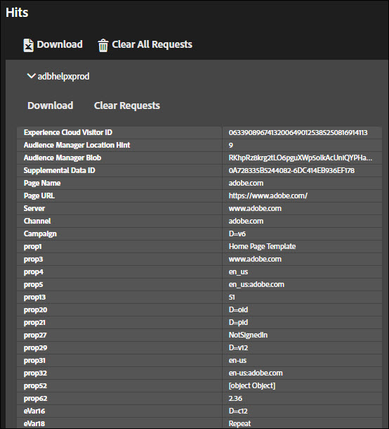
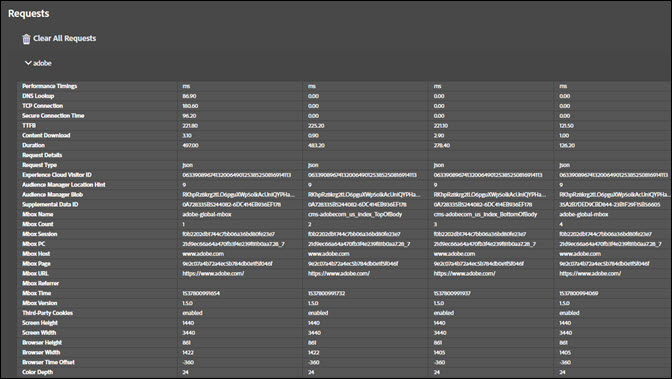

# Pestañas de solución{#solution-tabs}

Haga clic en las pestañas de solución para ver los resultados de soluciones específicas de Adobe Experience Cloud.

## Analytics {#section-f71dfcc22bb44c86bec328491606a482}

La pestaña Analytics proporciona información sobre su implementación de [Analytics](https://docs.adobe.com/content/help/es-ES/analytics/landing/home.html).

**Visitas**

De forma predeterminada, todas las llamadas al servidor realizadas al mismo grupo de informes se contraen.

**Descargar:** Descargue información sobre todos los grupos de informes mostrados como una hoja de cálculo de Excel.

**Borrar todas las solicitudes:** Elimine todas las solicitudes mostradas de la vista de Analytics. Después de borrar las solicitudes, se mostrarán nuevas solicitudes cuando se produzcan.

Haga clic en la ID del grupo de informes para expandir la vista:

Esta pantalla muestra todas las solicitudes desde que se abrió Adobe Experience Platform Debugger o se borraron las solicitudes. Los parámetros predeterminados se asignan automáticamente a nombres descriptivos. Las variables [prop y eVar](https://docs.adobe.com/content/help/es-ES/analytics/implementation/vars/page-vars/evar.html) se pueden asignar a sus nombres descriptivos personalizados (por ejemplo, “prop1” podría mostrarse como “Tipo de usuario”) si se autentica con la función “Link AnalyticsLink AnalyticsLink AnalyticsLink Analytics” (ver a continuación). Las solicitudes se muestran en secuencia de izquierda a derecha.

**Descargar:** Guarde todas las solicitudes realizadas en el grupo de informes como una hoja de cálculo de Excel.

**Borrar solicitudes:** Elimine todas las solicitudes realizadas a este grupo de informes. Las nuevas solicitudes aparecen a medida que se producen.

**Cuentas vinculadas (heredadas)**

Haga clic en **[!UICONTROL Link Account]** y, a continuación, introduzca la información solicitada para vincular una cuenta de Analytics a Platform Debugger.

>[!NOTE]
>
>Actualmente, esta función solo es compatible con las credenciales de inicio de sesión de usuario heredadas de Analytics.

**Recuperar visitas posteriores al procesamiento**

Active la opción Recuperar visitas posteriores al procesamiento si desea ver los valores de las visitas de Analytics después de ejecutar las reglas de procesamiento. Debe iniciar sesión en Adobe Experience Cloud para que esta funcionalidad se ejecute correctamente.

Cuando esta opción está habilitada, se agrega un parámetro de depuración a las solicitudes de Analytics. Las visitas se siguen procesando como cualquier otra visita. Platform Debugger sondea la API de depuración de Analytics para recuperar los valores de las reglas posteriores al procesamiento de cualquier visita que tenga un ID de visita individual original. Las visitas posteriores al procesamiento tienen un fondo morado y se muestran junto a la visita original.

Para la mayoría de las implementaciones de Analytics, la información de reglas posteriores al procesamiento estará disponible en unos minutos. La implementación de Analytics para Target (A4T) tarda mucho más.

## Target {#section-988873ba5ede4317953193bd7ac5474c}

Utilice la pestaña Target para ver las solicitudes de [Target](https://docs.adobe.com/content/help/es-ES/target/using/target-home.html) o los detalles de respuesta de [seguimiento de mbox](https://docs.adobe.com/content/help/es-ES/target/using/activities/troubleshoot-activities/content-trouble.html).

Haga clic en **[!UICONTROL Requests]** y expanda el entorno para ver información sobre Target.

Haga clic en **[!UICONTROL Clear All Requests]** para eliminar las solicitudes que se muestran actualmente. Se mostrarán más solicitudes a medida que se realicen.

También puede utilizar el filtro de Target para [habilitar el seguimiento de MBox para fines de depuración de Target](https://docs.adobe.com/content/help/en/target/using/activities/troubleshoot-activities/content-trouble.html).

Debe tener una pestaña de Chrome abierta que esté autenticada en Experience Cloud para habilitar el seguimiento de mbox. Una vez activado, muestra el nombre de usuario de su Adobe ID. Amplíe su nombre de usuario para mostrar los códigos de cliente de Target asociados con las organizaciones de Experience Cloud a las que tiene acceso. Haga clic en el código de cliente para el que desea habilitar el seguimiento de mbox y confirme que aparece la marca de verificación verde. Ahora aparecerán todas las solicitudes de Target con información de seguimiento de mbox, agrupadas por código de cliente. Para explorar la información de seguimiento de mbox, expanda la solicitud para ver las pestañas:

* [Actividades](https://docs.adobe.com/content/help/es-ES/target/using/activities/activities.html)  La pestaña Actividades muestra todas las actividades asociadas al nombre de la solicitud de Target, independientemente de si cumple los requisitos para la actividad. “Actividades coincidentes” son las actividades para las que reúne los requisitos y cuyas ofertas se entregaron en la respuesta. Puede ampliar el nombre de la actividad para confirmar la experiencia en la que se encuentra y las audiencias y condiciones de segmentación que cumplen los requisitos para la actividad. “Actividades evaluadas” son todas las actividades evaluadas, independientemente de si reúne los requisitos o no. Para solucionar el problema por el que no se cumplen los requisitos para una actividad “Evaluada” pero no “Coincidente”, expanda el nombre de la actividad y revise la sección “Audiencias no coincidentes”.

* Solicitud

   La pestaña de solicitud de [Seguimiento de mbox](https://docs.adobe.com/content/help/en/target/using/activities/troubleshoot-activities/content-trouble.html) es similar a la pestaña de solicitud principal. Puede ver todos los parámetros pasados por la solicitud de Target, además de los encabezados de solicitud.
* Perfil

   Expanda la sección Instantánea de perfil para ver la [información de perfil](https://docs.adobe.com/content/help/es-ES/target/using/audiences/visitor-profiles/variables-profiles-parameters-methods.html) almacenada sobre usted como visitante en la base de datos de perfiles de Target. Aquí se exponen todos los perfiles en mbox y de secuencia de comandos, así como algunos perfiles del sistema. La columna Estado muestra qué perfiles han cambiado en el ámbito de esta solicitud, así como sus valores antes y después de que la solicitud ingresara al sistema de perfiles.
* Audience Manager

   Las secciones “segmentIds” y “cachedSegmentIds” de la pestaña Audience Manager muestran los ID de [audiencias](https://docs.adobe.com/content/help/es-ES/target/using/audiences/target.html) compartidas de Experience Cloud a Target y para las que reúne las condiciones. Pueden ser audiencias creadas en Audience Manager, Analytics o el generador de audiencias en el servicio principal People. Estos ID se pueden buscar en la interfaz de usuario de Audience Manager para encontrar el nombre de la audiencia.

El siguiente vídeo muestra la funcionalidad general de Target:

>[!VIDEO](https://video.tv.adobe.com/v/23115t2/)

El siguiente vídeo muestra el seguimiento de mbox:

>[!VIDEO](https://video.tv.adobe.com/v/23113t2/)

## Audience Manager {#section-1d4484f8b46f457f859ba88039a9a585}

Utilice la pestaña [Audience Manager](https://docs.adobe.com/content/help/es-ES/audience-manager/user-guide/aam-home.html) para ver los detalles de los [eventos](https://docs.adobe.com/content/help/es-ES/audience-manager/user-guide/api-and-sdk-code/dcs/dcs-event-calls/dcs-event-calls.html). Haga clic en la organización para expandirla y mostrar la información.

Haga clic en **[!UICONTROL Clear All Events]** para restablecer la información mostrada. Aparecerán nuevos eventos a medida que ocurran.

**Sincronización de ID**

La sincronización de ID es el primer paso en el proceso de transferencia de datos entrante y asincrónico. En este paso, Audience Manager y el proveedor comparan y hacen coincidir los ID de sus respectivos visitantes del sitio.

Consulte [Sincronización de ID para transferencias de datos de entrada](https://docs.adobe.com/content/help/es-ES/audience-manager/user-guide/implementation-integration-guides/sending-audience-data/batch-data-transfer-process/id-sync-http.html) en la documentación del producto de Audience Manager para obtener más información.

## Advertising Cloud {#section-ee80a9c509f2462c89c1e5bd8d05d7c8}

Utilice la pestaña Advertising Cloud para ver las solicitudes de Advertising Cloud.

Haga clic en **[!UICONTROL Requests]** y expanda el entorno para ver información sobre Advertising Cloud.

Haga clic en **[!UICONTROL Clear All Requests]** para eliminar las solicitudes que se muestran actualmente. Se mostrarán más solicitudes a medida que se realicen.

## Servicio de Experience Cloud ID {#section-a96c32f8e63a4991abb296f6e8ea01cf}

Utilice la pestaña Servicio de ID de Experience Cloud para ver las solicitudes del [servicio de Experience Cloud ID](https://docs.adobe.com/content/help/es-ES/id-service/using/home.html).

Haga clic en **[!UICONTROL Requests]** y, a continuación, expanda el entorno para ver información sobre el servicio de Experience Cloud ID.

Haga clic en **[!UICONTROL Clear All Requests]** para eliminar las solicitudes que se muestran actualmente. Se mostrarán más solicitudes a medida que se realicen.
